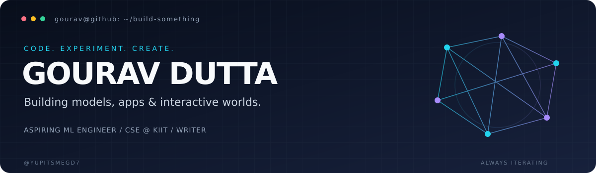

<p align="center">
  
</p>

<p align="center">
  <a href="https://github.com/yupitsmegd7?tab=repositories"></a>
  <a href="https://vatavarnam-1.onrender.com/"></a>
  <a href="https://github.com/yupitsmegd7?tab=followers"></a>
</p>

## `01 / whoami`

I'm **Gourav Dutta**, a Computer Science undergraduate at **KIIT University**, working toward becoming a **Machine Learning Engineer**.

I build across machine learning, full-stack development, and interactive simulations. My favourite part is taking an idea from a notebook to something people can actually use. Outside code, I write stories and poetry.

```python
class Gourav:
    location = "India"
    education = "B.Tech CSE · KIIT · 2025–2029"
    interests = ["Machine Learning", "NLP", "Web Apps", "Simulations"]
    approach = "Build → test → understand → improve"
```

## `02 / toolkit`

**Web & application development**

<p>
  
</p>

**Python, machine learning & data**

<p>
  
</p>
<p>
  
  
  
  
</p>

**Fundamentals & developer tools**

<p>
  
</p>
<p>
  <a href="https://github.com/yupitsmegd7/DSA_Self"></a>
  <a href="https://leetcode.com/"></a>
</p>

## `03 / selected builds`

<table>
<tr>
<td width="50%" valign="top">
<h3>🌫️ Vatavarnam</h3>
<p>Air-quality forecasting for Delhi NCR: a 72-hour outlook with weather inputs, ML models, and interactive pollution maps.</p>
<p><code>Python</code> <code>scikit-learn</code> <code>Flask</code> <code>React</code></p>
<p><a href="https://github.com/yupitsmegd7/Vatavarnam">Explore code ↗</a> · <a href="https://vatavarnam-1.onrender.com/">Live app ↗</a></p>
</td>
<td width="50%" valign="top">
<h3>🍳 Fridge Quest</h3>
<p>A game-inspired cooking app that turns your ingredients into recipe ideas, cooking steps, nutrition estimates, and chef XP.</p>
<p><code>Next.js</code> <code>TypeScript</code> <code>React</code> <code>AI recipes</code></p>
<p><a href="https://github.com/yupitsmegd7/Fridge_Quest">Explore code ↗</a></p>
</td>
</tr>
<tr>
<td width="50%" valign="top">
<h3>🛰️ Fieldwork · Simulation Lab</h3>
<p>Interactive 3D experiments with drone flight, lunar exploration, and football trajectories. Change conditions and see the response.</p>
<p><code>JavaScript</code> <code>Three.js</code> <code>WebGL</code></p>
<p><a href="https://github.com/yupitsmegd7/Simulation.io">Explore code ↗</a></p>
</td>
<td width="50%" valign="top">
<h3>🛡️ Signal · Spam Detector</h3>
<p>An NLP web app that classifies messages as spam, authentic, or uncertain, with confidence scores and a simple interface.</p>
<p><code>Python</code> <code>spaCy</code> <code>Flask</code> <code>NLP</code></p>
<p><a href="https://github.com/yupitsmegd7/SpamClasssifier_Website">Explore code ↗</a> · <a href="https://spam-classsifier.onrender.com/">Live app ↗</a></p>
</td>
</tr>
</table>

**Inside the workshop:** [Simple ML — models, notebooks & experiments](https://github.com/yupitsmegd7/Simple_ML) · [The Marksman — news aggregation](https://github.com/yupitsmegd7/The_Marksman) · [DSA practice](https://github.com/yupitsmegd7/DSA_Self)

## `04 / contribution trail`

Every square is part of the journey. This snake follows my GitHub contribution history and refreshes daily.

<picture>
  <source media="(prefers-color-scheme: dark)" srcset="https://raw.githubusercontent.com/yupitsmegd7/yupitsmegd7/output/github-snake-dark.svg" />
  <source media="(prefers-color-scheme: light)" srcset="https://raw.githubusercontent.com/yupitsmegd7/yupitsmegd7/output/github-snake.svg" />
  
</picture>

<p align="center">
  <a href="https://github.com/yupitsmegd7/yupitsmegd7/actions/workflows/snake.yml"></a>
</p>

## `05 / let's build`

Interested in **applied ML, useful web apps, or interactive learning tools**? Explore a repository, open an issue with an idea, or build on something here.

<p align="center"><b>Curiosity in. Useful software out.</b><br /><sub>Gourav Dutta · @yupitsmegd7</sub></p>
