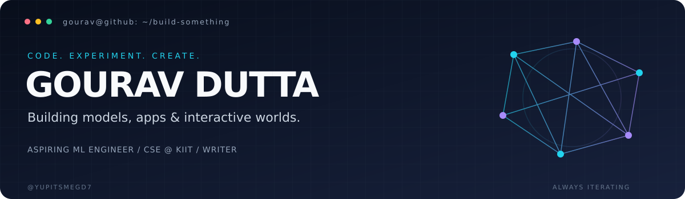

<p align="center">
  
</p>

<p align="center">
  <a href="https://github.com/yupitsmegd7?tab=repositories"></a>
  <a href="https://vatavarnam-1.onrender.com/"></a>
  <a href="https://github.com/yupitsmegd7?tab=followers"></a>
</p>

## `01 / whoami`

I'm **Gourav Dutta**, a Computer Science undergraduate at **KIIT University**, working toward becoming a **Machine Learning Engineer**.

I build across **machine learning, full-stack development, and interactive simulations**, with a growing interest in turning data and ideas into tools people can actually use. My projects explore air quality, environmental monitoring, adaptive learning, accessible information, and everyday utilities—usually starting with a question I want to solve for myself or my community.

I'm learning the complete journey: preparing data, experimenting with models, building APIs, designing interfaces, and connecting those pieces into a working application. I care about understanding what a system does well, where it falls short, and how each iteration can make it more useful.

Beyond code, I'm a **writer of stories and poetry**. That creative side shapes the reading spaces, visual themes, and learning experiences I build. I'm also the **OpenAI Student Collective Campus Lead at KIIT**, bringing my interest in AI into student learning and community projects.

```python
class Gourav:
    location = "India"
    education = "B.Tech CSE · KIIT · 2025–2029"
    interests = ["Machine Learning", "NLP", "Web Apps", "Simulations"]
    approach = "Build → test → understand → improve"
```

## `02 / toolbox`

**Web & application development**

<p>
  
  
  
  
  
  
  
</p>

**Python, machine learning & data**

<p>
  
  
  
  
  
</p>
<p>
  
  
  
  
</p>

**Fundamentals & developer tools**

<p>
  
  
  
  
  
</p>
<p>
  <a href="https://github.com/yupitsmegd7/DSA_Self"></a>
  <a href="https://leetcode.com/"></a>
</p>

## `03 / projects`

<p>From environmental data and learning tools to practical utilities and creative spaces—here is what I've been building.</p>

**Recent builds / in the spotlight**

<table>
<tr>
<td width="50%" valign="top">
<h3>🔄 Local · File & Creative Toolbox</h3>
<p>Convert documents, images, audio and video directly in the browser. A 500 MB batch queue, layout-aware document modes, English/Hindi OCR and six creative tools keep everyday file work in one place.</p>
<p><code>React</code> <code>Vite</code> <code>FFmpeg.wasm</code> <code>Tesseract.js</code></p>
<p><a href="https://github.com/yupitsmegd7/Local">Explore code ↗</a> · <a href="https://localconverter-flame.vercel.app/">Live app ↗</a></p>
</td>
<td width="50%" valign="top">
<h3>🌍 Prithvi · Disaster Observatory</h3>
<p>Explore five hazard views across ten Indian areas, environmental feeds, historical charts and preparedness simulations. Includes separate rainfall and dry-week ML experiments; the live dashboard is a research screening prototype.</p>
<p><code>TypeScript</code> <code>React</code> <code>Python</code> <code>scikit-learn</code></p>
<p><a href="https://github.com/yupitsmegd7/Prithvi-Disaster_Management">Explore code ↗</a></p>
</td>
</tr>
<tr>
<td width="50%" valign="top">
<h3>⚖️ Nyaya · Legal Information</h3>
<p>An Indian legal-information portal with a rights atlas, searchable law and crime entries, official-source statistics, practical guides and helplines. Its situation finder supports optional cited AI explanations.</p>
<p><code>React</code> <code>TypeScript</code> <code>Vinext</code> <code>API routes</code></p>
<p><a href="https://github.com/yupitsmegd7/Nyaya">Explore code ↗</a></p>
</td>
<td width="50%" valign="top">
<h3>🧠 DSA Verse · Learning Atelier</h3>
<p>An adaptive DSA tutor with 16 topics, C/Java/Python examples, graded practice, spaced reviews, a connected mastery map and a mistake journal. Includes a hackathon news observatory and four visual themes.</p>
<p><code>Next.js</code> <code>TypeScript</code> <code>React</code> <code>Adaptive practice</code></p>
<p><a href="https://github.com/yupitsmegd7/DSA_Verse">Explore code ↗</a></p>
</td>
</tr>
<tr>
<td width="50%" valign="top">
<h3>🍂 Safar-e-Rachna · Literary Journal</h3>
<p>A home for poems, articles and reviews, pairing a dark-academia aesthetic with author publishing, reader likes and comments, fuzzy search, related posts and a timed writing practice desk.</p>
<p><code>Next.js</code> <code>TypeScript</code> <code>Supabase</code></p>
<p><a href="https://github.com/yupitsmegd7/Safar-e-Rachna">Explore code ↗</a></p>
</td>
<td width="50%" valign="top">
<h3>📖 Dharma Gita · Read, Reflect, Practice</h3>
<p>A multilingual scripture companion with 18 Gita chapters, 54 mantra passages, 24 curated reading paths and daily habit practice. Source-linked teachings meet an illustrated, animated reading experience.</p>
<p><code>JavaScript</code> <code>HTML</code> <code>CSS</code> <code>Local search</code></p>
<p><a href="https://github.com/yupitsmegd7/Dharma_Gita">Explore code ↗</a> · <a href="https://dharma-gita-five.vercel.app/">Hosted preview ↗</a></p>
</td>
</tr>
</table>

**More from my workshop**

<table>
<tr>
<td width="50%" valign="top">
<h3>🌫️ Vatavarnam</h3>
<p>Air-quality forecasting for Delhi NCR: a 72-hour outlook with weather inputs, ML models, and interactive pollution maps.</p>
<p><code>Python</code> <code>scikit-learn</code> <code>Flask</code> <code>React</code></p>
<p><a href="https://github.com/yupitsmegd7/Vatavarnam">Explore code ↗</a> · <a href="https://vatavarnam-1.onrender.com/">Live app ↗</a></p>
</td>
<td width="50%" valign="top">
<h3>🍳 Fridge Quest</h3>
<p>A game-inspired cooking app that turns your ingredients into recipe ideas, cooking steps, nutrition estimates, and chef XP.</p>
<p><code>Next.js</code> <code>TypeScript</code> <code>React</code> <code>AI recipes</code></p>
<p><a href="https://github.com/yupitsmegd7/Fridge_Quest">Explore code ↗</a></p>
</td>
</tr>
<tr>
<td width="50%" valign="top">
<h3>🛰️ Fieldwork · Simulation Lab</h3>
<p>Interactive 3D experiments with drone flight, lunar exploration, and football trajectories. Change conditions and see the response.</p>
<p><code>JavaScript</code> <code>Three.js</code> <code>WebGL</code></p>
<p><a href="https://github.com/yupitsmegd7/Simulation.io">Explore code ↗</a></p>
</td>
<td width="50%" valign="top">
<h3>🛡️ Signal · Spam Detector</h3>
<p>An NLP web app that classifies messages as spam, authentic, or uncertain, with confidence scores and a simple interface.</p>
<p><code>Python</code> <code>spaCy</code> <code>Flask</code> <code>NLP</code></p>
<p><a href="https://github.com/yupitsmegd7/SpamClasssifier_Website">Explore code ↗</a> · <a href="https://spam-classsifier.onrender.com/">Live app ↗</a></p>
</td>
</tr>
</table>

**Inside the workshop:** [Simple ML — models, notebooks & experiments](https://github.com/yupitsmegd7/Simple_ML) · [The Marksman — news aggregation](https://github.com/yupitsmegd7/The_Marksman) · [DSA practice](https://github.com/yupitsmegd7/DSA_Self) · [Backend foundations — Node.js, Express & MongoDB](https://github.com/yupitsmegd7/intro_to_backend)

## `04 / contribution trail`

Every square is part of the journey. This snake follows my GitHub contribution history and refreshes daily.

<picture>
  <source media="(prefers-color-scheme: dark)" srcset="https://raw.githubusercontent.com/yupitsmegd7/yupitsmegd7/output/github-snake-dark.svg" />
  <source media="(prefers-color-scheme: light)" srcset="https://raw.githubusercontent.com/yupitsmegd7/yupitsmegd7/output/github-snake.svg" />
  
</picture>

<p align="center">
  <a href="https://github.com/yupitsmegd7/yupitsmegd7/actions/workflows/snake.yml"></a>
</p>

## `05 / let's build`

Interested in **applied ML, useful web apps, or interactive learning tools**? Explore a repository, open an issue with an idea, or build on something here.

<p align="center"><b>Curiosity in. Useful software out.</b><br /><sub>Gourav Dutta · @yupitsmegd7</sub></p>

